- Paulus Bimo Satrio Aji
- Politeknik Elektronika Negeri Surabaya
- Frontend Web Development
- FEBE-32 and FE-8
---

# Writing and Presentation Test Week 6

## Senin, 24 Oktober 2022

### A. **React JS**

- **React JS** adalah library Javascript untuk memmbuat interface (tampilan) pada website berbasis UI Components.
- **React JS** mengoptimalkan Single Page Application (SPA) website, yang memungkinkan untuk hanya merender component yang berubah saja.

- **Installasi React**
  - Install package Node JS
  - Membuat library create-react-app (CRA) dengan salah satu command dibawah:
    - npx
        ```
        npx create-react-app my-app
        ```
    - npm
        ```
        npm init react-app my-app
        ```
    - yarn
        ```
        yarn create react-app my-app
        ```
  - Start project dengan salah satu command dibawah:
    - npm
        ```
         npm start
        ```
    - yarn
        ```
        yarn start
        ```
### B. **JSX**

- JSX adalah extension syntax JavaScript yang digunakan untuk memodifikasi Document Object Model (DOM) dengan kode HTML.

  - JSX Rules
    - Setiap JSX hanya bisa memiliki 1 parent element
  
  - The Virtual DOM
    - **DOM** adalah suatu konsep untuk mengakses dokumen serta dapat dimodifikasi. Dengan DOM, kita bisa mengakses, mengubah, mendelete suatu dokumen (atau tag) dalam HTML.
    - Pada **Virtual DOM**, terlebih dahulu dibuat abstraksi DOM dalam bentuk virtual. Sehingga setiap perubahan terhadap struktur dokumen tidak terjadi secara langsung pada tampilan browser, akan tetapi terjadi di dalam memory. Sehingga proses menjadi lebih cepat.
    - Ketika terjadi update pada suatu component, React JS hanya melalukan render ulang pada component tersebut saja.

  - Class dan ClassName       
     
    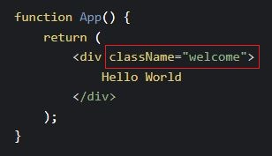
  - Curly Brackets
        
    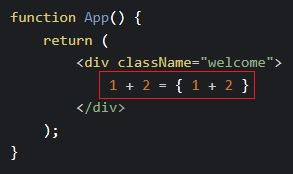
  - Variable
        
    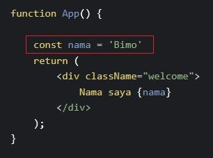
  - Attribute
        
    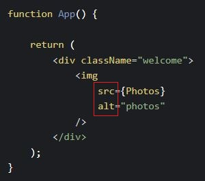
  - Event
        
    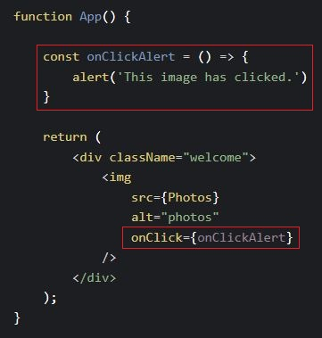
  - Conditional
    - Conditional Variables

        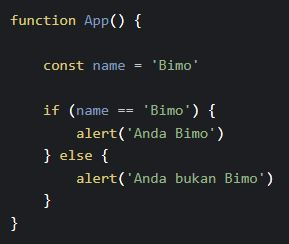
    - Conditional JSX

        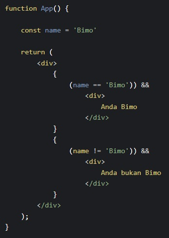

### C. **React Component**
- Component membagi UI dalam satuan-satuan kecil. Component dibuat supaya component tersebut reusable, sehingga ketika terdapat error di salah satu component, component lain tidak ikut bermasalah.

  - Parent Component
        
    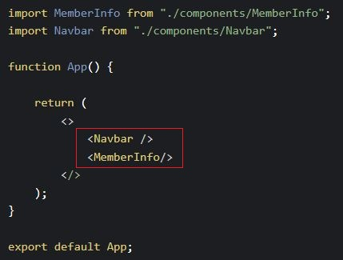
  - Child Component
        
    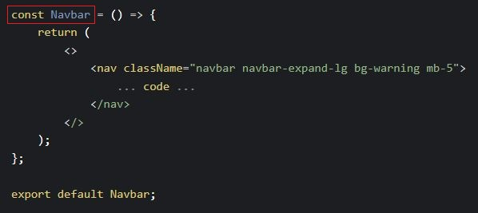

## Selasa, 25 Oktober 2022

### A. **State & Props**

- **State & Props** adalah hal yang berhubungan dengan Stateless dan Stateful Component. Stateless berarti tidak memiliki State. Dia hanya memiliki props. Stateful berarti emmiliki state dan bisa mengirim state tersebut ke component.

- **State** digunakan untuk menyimpan data di component tersebut saja (local).
        
    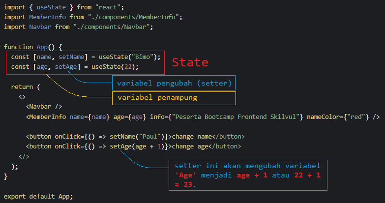
  
- **Props** digunakan untuk menyimpan data yang akan dikirim ke component lain.
  - Props Parent ( ***App.js*** )
        
    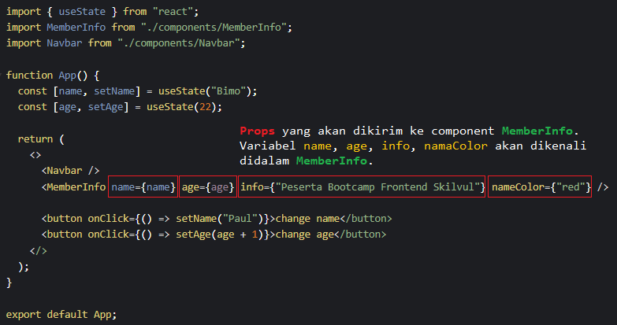
  - Props Child ( ***MemberInfo.js*** )
        
    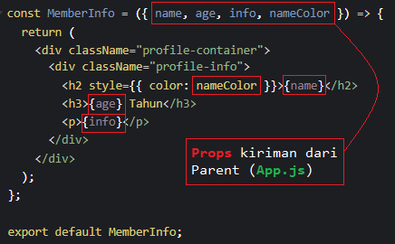

## Rabu, 26 Oktober 2022

### A. **Event Handler**

- React dapat melakukan call to action berdasarkan perintah pengguna. Seperti onClick, onChange, onSubmit, onMouseOver, dsb.
- Menambahkan Event
  ```
  <button onClick={change}> Ubah </button>
  ```
- Handler Event
        
    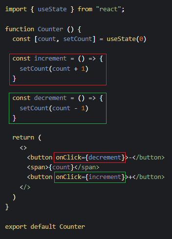

### B. **Array Map**

- **map()** dapat digunakan untuk melakukan iterasi object dalam suatu array dan memodifikasi konten dari setiap object individu dan menyimpan data tersebut dalam array yang baru.
        
  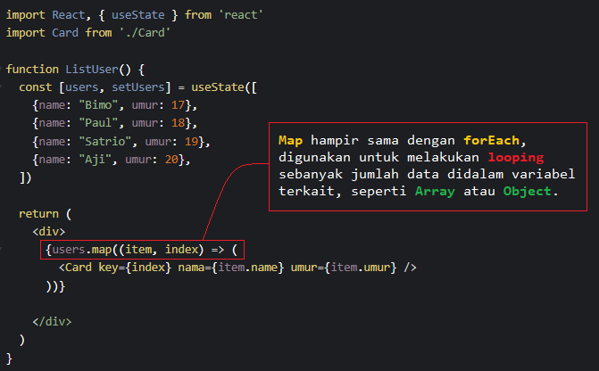
  - Dalam contoh diatas, component **Card** akan muncul sebanyak jumlah data yang ada dalam array ***users***, yaitu 4 kali.

## Kamis, 27 Oktober 2022

### A. **React Hooks**
- **React Hooks** adalah fungsi spesial yang memungkinkan user mengakses fitur-fitur di React. Contoh beberapa hooks:

  - useState
    - Untuk menyimpan data dalam sebuah state.
  - useEffect
    - UseEffect digunakan dalam functional component.
    - UseEffect akan jalan setiap kali item di dalam array tersebut berubah. Kalau arraynya kosong, useEffect akan dijalankan sekali saja, yaitu saat component pertama kali di render.
    - Penggunaannya mirip dengan componentDidMount dalam class component.
  - useRef, useMemo, dan lain-lain.

### B. **Lifecycle**

- Lifecyle pada react dibagi menjadi 3 fase, yaitu:
   - **Mount**: website kita sedang dimuat hingga ditampilkan.
   - **Update**: website kita menerima sebuah perubahan atau update dari suatu hal.
   - **Unmount**: website kita mulai menghilang atau berganti.
        
    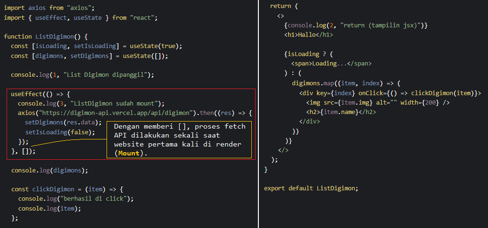

## Jumat, 28 Oktober 2022

### A. **Form**

- Contoh penggunaan form POST dalam React JS adalah sebagai berikut:
        
  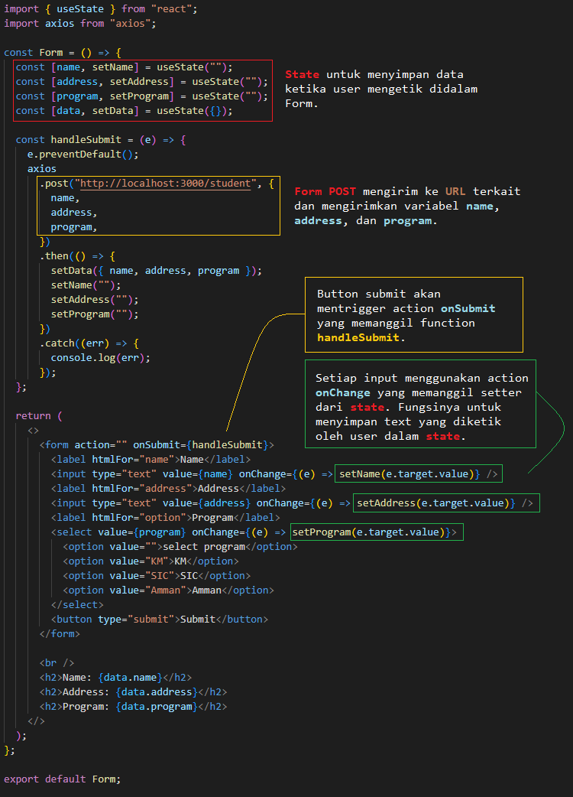