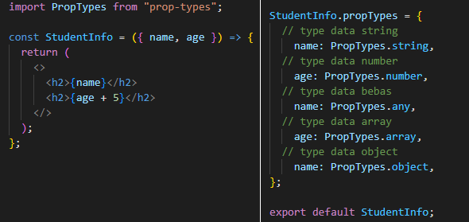
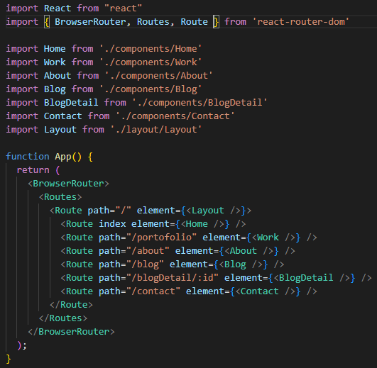
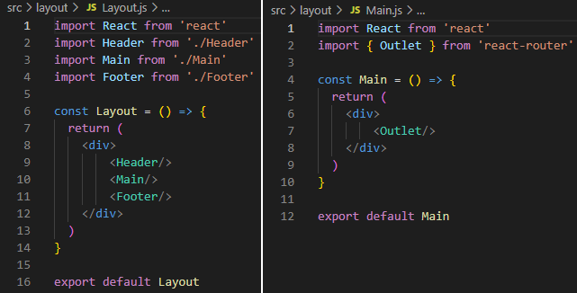
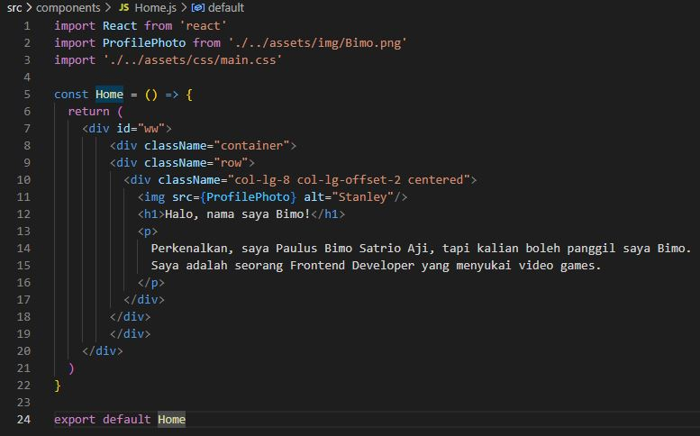
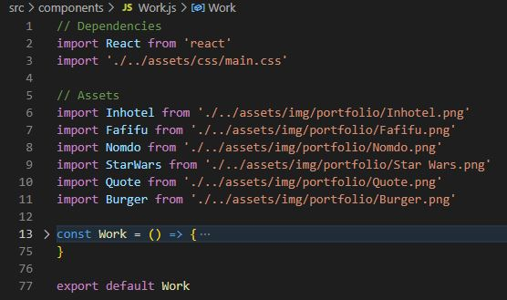
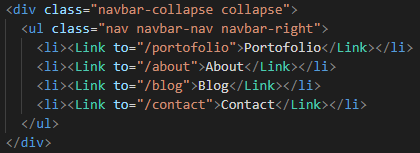
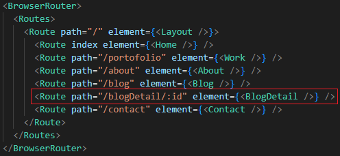
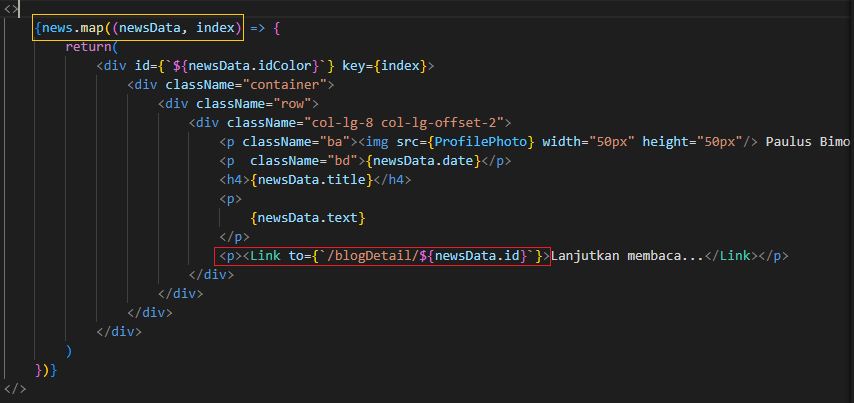
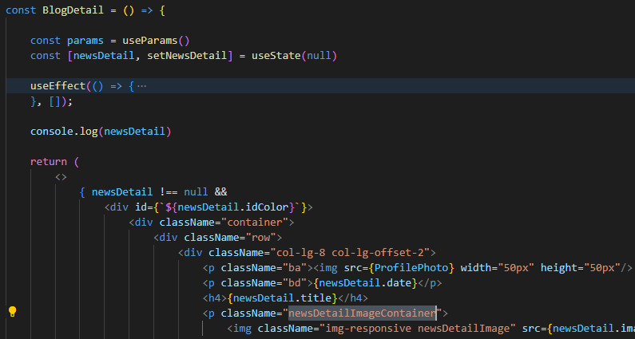
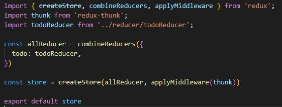

- Paulus Bimo Satrio Aji
- Politeknik Elektronika Negeri Surabaya
- Frontend Web Development
- FEBE-32 and FE-8
---

# Writing and Presentation Test Week 7

## Senin, 31 Oktober 2022

### A. **PropTypes**

- **PropTypes** merupakan sebuah library untuk memvalidasi props yang dikirim agar sesuai dengan tipe data yang diinginkan. Jika tidak sesuai, akan muncul pesan error.

- **Installasi PropTypes**
    ```
    npm install prop-types
    ```

- **Penggunaan PropTypes**
     
    
      
    - Pada gambar kanan, dapat dilakukan berbagai macam validasi tiper data. Mulai dari string, number, array, object, hingga any (apapun).
    - Jika validasi gagal, JSX akan tetap berjalan namun dalam console akan muncul pesan error.

## Selasa, 1 November 2022

### A. **React Router**

- Routing adalah proses pengarahan user ke suatau halaman. React Router sering digunakan dalam Single Page Application Website (SPA). 
- React Router digunakan untuk menentukan beberapa rute dalam aplikasi. Saat pengguna masuk ke URL tertentu pada browser dan jika rute URL ini cocok dengan data tersebut, pengguna langsung diarahkan ke rute (halaman) tersebut.

- **Installasi React Router**
    ```
    npm install react-router-dom
    ```

- **Penggunaan React Router**

  - Setup daftar routes dalam **App.js**

    

    - **BrowserRouter** adalah router yang menggunakan location untuk sinkronisasi UI dengan URL.
    - **Switch** digunakan untuk membungkus node Route, untuk merender satu Route saat path sesuai dengan URL.
    - **Route** digunakan untuk merender UI saat path sesuai dengan URL.

  - Setup Layout dalam **Layout.js** dan **Main.js** . Jika ingin menyisipkan navbar dan footer, tinggal panggil component tersebut dalam **Layout.js**. Jika tidak, tinggalkan component **Main** sendirian.

    

  - Buat halaman yang ingin dijadikan route. Contoh **Home.js** untuk route **"/"** yang diinisialisasi dengan nama route *index*.

    

  - Untuk halaman selain *index* adalah **Work.js** dengan nama route **/work**

    

  - Untuk mengakses halaman, tinggal membuat component **Link** untuk membungkus area yang dapat di klik, kemudian memasukan nama **/route**

    

### B. **Params**

- **Param** digunakan untuk menuju halaman dengan id yang bersangkutan.

- **Import useParams**
    ```
    import { useParams } from 'react-router-dom'
    ```

- **Penggunaan Params**

  - Inisialisasikan route dalam **App.js**. Dalam contoh ini adalah component **BlogDetail** dengan nama route ***"/blogDetail/:id"***

    

  - Setup pintu masuk menuju halaman terkait. Dalam contoh buat looping dengan array Map kemudian buat route dengan component Link dengan tambahan **id** dari data.
  - **id** disini digunakan sebagai pembeda antar satu data dengan lainnya dalam array yang diambil.

    
    
  - Buat halaman detail item yang menjadi halaman akhir atau detail dari item terkait.

    

## Rabu-Kamis, 2-3 November 2022

### A. **React Redux**

- **Redux** adalah library state management yang bisa menyimpan banyak state di satu tempat, sehingga lebih mudah untuk di manage. Redux biasa digunakan dalam aplikasi dengan state skala besar dan butuh management yang detail.

- **Installasi React Redux**
    ```
    npm install redux
    ```
    ```
    npm install react-redux
    ```
- Dalam **React Redux**, terdapat tiga part penting, yaitu Store, Reducer, dan Action.

  - **Store**
    - **Store** mempunyai beberapa tugas, seperti:
      - Menyimpan seluruh state.
        - contoh
          ```
          import { createStore } from 'redux'
          import reducer from './reducer'

          const store = createStore(reducer)

          export default store
          ```
      - Mengakses state.
        - contoh
          ```
          import store from './store'

          store.getState()
          ```
      - Menjalankan reducer untuk merubah state dengan menggunakan *dispatch(action)*.
        - contoh
          ```
          import ADD_DATA from './action'
          import store from './store'

          store.dispatch(ADD_DATA('data baru'))
          ```

  - **Reducer**

    - **Reducer** bertugas merubah state menjadi response yang terjadi ketika action dimasukan dalam *dispatch()*.

      ```
      const initialState = {}

      const reducer = (prevState = initialState, action) => {
        if (action.type === 'ADD_DATA') {
          return {...prevState, action.data }
      }

        return prevState
      }

      export default reducer
      ```

      - Jika action yang dimasukan dalam *dispatch()* bertipe *ADD_DATA*, maka akan mengembalikan object baru yang isinya *prevState* ditambah dengan data baru action.data dan hasil dari reducer inilah yang akan menjadi state yang baru.

  - **Action**

    - **Action** merupakan sebuah object yang memiliki property type.
      ```
      const ADD_DATA = { type: 'ADD_DATA' }
      ```
    - *Object action* ini nantinya akan dikirim ke **Store** dengan cara *store.dispatch(ADD_DATA)* dan dikirimkan kedalam reducer.

## Jumat, 4 November 2022

### A. **Redux Thunk**

  - Redux Thunk adalah sebuah  middleware yang memungkinkan untuk menulis Action yang mengembalikan function. 
  - Redux pada umumnya mereturn dalam bentuk props actions yang telah di definisikan oleh Reducers. Namun, masalahnya jika kita ingin mengembalikan sebuah function, redux tidak dapat menanganinya.
  - Redux Thunk dibuat sebagai middleware yang berfungsi untuk mengembalikan action.

- **Installasi Redux Thunk**
    ```
    npm install redux-thunk
    ```

- **Penggunaan Redux Thunk**
     
    