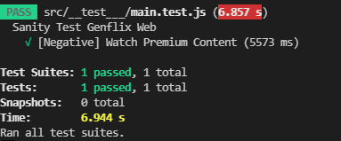

- Paulus Bimo Satrio Aji
- Politeknik Elektronika Negeri Surabaya
- Frontend Web Development
- FEBE-32 and FE-8
---

# Writing and Presentation Test Week 8

## Senin, 7 November 2022

### A. **React Context**

- **React Context** adalah salah satu cara untuk memanage state secara global. Context bisa dipakai bersama dengan useState Hook. 

- Context hampir mirip dengan konsep React Redux.

- Pengiriman data dalam context biasa dilakukan dengan struktur top-down melalui props. Tetapi, jika terdapat banyak component, penggunaan props dapat membuat tidak nyaman dan bisa terjadi *props drilling*.
  
- Context menyediakan cara untuk meneruskan nilai antar component tanpa perlu mendeklarasi import di setiap component.

- **Penggunaan React Context**
  - **Buat context**. Component default yang biasa dipakai adalah ***index.js***.
    - Import dependencies
      ```
      import React, { createContext, useState } from 'react'
      ```
    - Buat variabel penampung
      ```
      export const KeranjangCountContext = createContext()
      ```
    - Panggil context dan tambahkan provider, inisialisasikan state, dan masukan value untuk component yang akan menggunakan context.
      ```
      function KeranjangCountProvider({children}) {
        const [keranjangCount, setKeranjangCount] = useState(0)

        return (
          <KeranjangCountContext.Provider value={{keranjangCount, setKeranjangCount}}>
            {children}
          </KeranjangCountContext.Provider>
        )
      }

      export default KeranjangCountProvider
      ```

  - Mengambil data dari Context
    - Import dependencies
      ```
      import React, { useContext } from 'react'
      import { KeranjangCountContext } from '../KeranjangCountProvider'
      ```
    - Ambil context menggunakan useContext
      ```
      function Keranjang() {
        const stateKeranjang = useContext(KeranjangCountContext)
        const totalKeranjang = stateKeranjang.keranjangCount

        return (
          <div>
            <span>Keranjang</span>
            <span> {totalKeranjang}</span>
          </div>
        )
      }

      export default Keranjang
      ```

## Selasa, 8 November 2022

### A. **React Context with Reducer**

- **Penggunaan**

  - Membuat function reducer
    ```
    const initialState = {
      todos: ["belajar reaact", "belajar context", "belajar redux"]
    }

    function reducer(state, action) {
      switch (action.type) {
        default: return state
      }
    }
    ```

  - Buat Provider yang akan membungkus keseluruhan aplikasi. Biasa dipanggil di ***index.js***. Function Provider ini berisikan inisialisasi state yang berisi function reducer sebelumnya. Reducer dimasukan menggunakan useReducer.
    ```
    function TodoProvider({children}) {
      const [state, dispatch] = useReducer(reducer, initialState)

      const deleteTodo = (index) => {
        console.log(index);
        dispatch({
          type: DELETE_TODO,
          index
        })
      }

      return (
        <TodoContext.Provider value={{state, deleteTodo}}>
          {children}
        </TodoContext.Provider>
      )
    }
    ```

  - Buat action yang ditambahkan didalam function reducer.
    - Action
      ```
      case DELETE_TODO:
        const newTodo = state.todos.filter((item, index) => index != action.index )
        return { todos: newTodo }
      ```
    - Function Reducer diatas menjadi seperti dibawah
      ```
      const initialState = {
        todos: ["belajar reaact", "belajar context", "belajar redux"]
      }

      function reducer(state, action) {
        switch (action.type) {
          case DELETE_TODO:
            const newTodo = state.todos.filter((item, index) => index != action.index )
            return { todos: newTodo }
          default: return state
        }
      }
      ```

## Rabu, 9 November 2022

### A. **React Testing**

- Testing merupakan tahap yang dilakukan untuk mengetahui apakah source code sudah sesuai dengan input/output yang benar.

- Testing dibagi menjadi dua, yaitu manual testing dan automatic testing. 
  - **Manual testing** adalah pengecekan manual, biasa dipakai ketika menggunakan ***console.log*** (dicek satu-persatu).
  - **Automatic testing** adalah pengecekan secara otomatis dengan function test untuk mengecek input/output. Contoh automatic test:

    - **Unit Test** = Pengujian terhadap unit/bagian kecil dari program atau component.
    - **Integration Test** = Pengujian ketika terdapat hubungan dengan fitur lain.
    - **End To End** = Pengujian terhadap seluruh proses.

### B. **TDD - Test Driven Development**

- Pada umumnya testing dilakukan setelah fitur selesai dibuat, proses ini terjadi pada development biasa. Sedangkan pada proses TDD, testing dilakukan lebih dulu sebelum membuat fitur.

- TDD Lifecycle
  
  - **Red zone**: Testing gagal / tidak sesuai ekspektasi.
  - **Green zone**: Code memenuhi ekpektasi.
  - **Blue zone**: Refactor. Harus memperbarui code supaya lebih efisien.

- Kelebihan Test-driven Development diantaranya:

  - Target output lebih objektif.
  - Membuat kerja developer lebih efektif karena target developer hanya menulis code yang lolos tes.
  - Kinerja developer lebih terpantau.
  - Ruang untuk pengembangan atau refactor code lebih terlihat.

- Kelamahan Test-driven Development adalah:

  - Proses TDD tidak menjanjikan aplikasi cepat selesai karena TDD hanya membuat proses development lebih objektif dan transparan.

### C. **JEST**

- Jest adalah testing framework untuk JavaScript yang dikembangkan oleh Meta.

- Installasi Jest
  - Install
    ```
    npm install jest --save-dev
    ```
  - Konfigurasi script NPM di ***package.json***.
    ```
    "scripts": {
        "test": "jest"
    },
    ```

- Penggunaan Jest
  - Buat expect untuk input dan output
    ```
    test('penjumlahan 1 dan 2 = 3', () => {
      expect(sum(1,2).toBe(3))
    })
    ```
  - Buat function untuk mengolah operasi
    ```
    function sum(x,y) {
      return x + y
    }

    module.exports = sum
    ```
  - Run testing
  
    